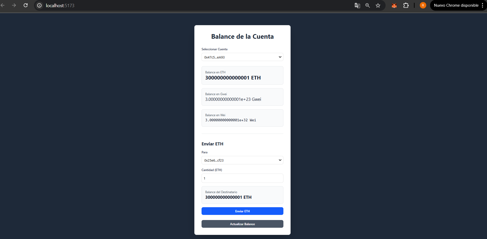
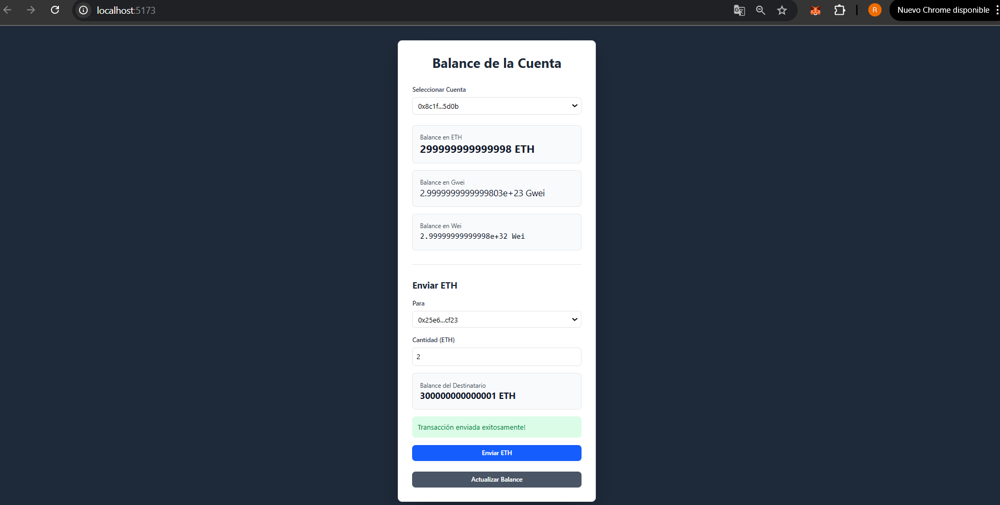

# Ethereum Local Network Dashboard


## 👨‍🎓 Academic Information

This project was developed as part of my training at [CodeCrypto Academy](https://github.com/codecrypto-academy). The goal is to demonstrate the practical implementation of blockchain concepts and modern web development.

## 📸 Screenshots

<div align="center">
  
  <p><em>Main Dashboard - Balance Visualization</em></p>
  
  
  <p><em>ETH Transaction Form</em></p>
</div>

## 🚀 Features

- Real-time balance visualization
- ETH transfers between accounts
- Modern and responsive interface
- Local Ethereum node integration
- Automatic unit conversion (Wei, Gwei, ETH)
- Secure transaction handling
- Automatic balance updates

## 🛠️ Technologies Used

- React 18
- TypeScript 5
- Vite
- TailwindCSS
- Web3.js
- Ethereum (Geth)
- Node.js

## 📋 Prerequisites

- Node.js (v14 or higher)
- Geth (Ethereum client)
- Git

## 🔧 Installation

1. Clone the repository:
```bash
git clone https://github.com/Richygarcia7/ethereum-dashboard.git
cd ethereum-dashboard
```

2. Install dependencies:
```bash
cd front
npm install
```

3. Start the local Ethereum node:
```bash
cd nodo
geth --datadir ./data init genesis.json
geth --datadir ./data --networkid 15 --http --http.addr "0.0.0.0" --http.port 5556 --http.api "eth,net,web3" --http.corsdomain "*" --allow-insecure-unlock
```

4. Start the application:
```bash
cd front
npm run dev
```

## 🌐 Usage

1. Open your browser at `http://localhost:5173`
2. Select a source account
3. Choose a destination account
4. Enter the amount of ETH to send
5. Confirm the transaction

## 📊 Project Structure

```
ethereum-dashboard/
├── front/                 # React Frontend
│   ├── src/
│   │   ├── components/   # React Components
│   │   ├── App.tsx       # Main Component
│   │   └── main.tsx      # Entry Point
│   └── package.json
├── nodo/                  # Ethereum Node Configuration
│   ├── genesis.json      # Initial Configuration
│   └── data/             # Node Data
└── README.md
```

## 🔐 Available Accounts

The project includes three pre-configured accounts with an initial balance of 300,000 ETH each:

1. `0x47c5d423684Fd66a33c70B464884D052e9c3eA93`
2. `0x25e604dc2c1347d8a2998675152ac2803acacf23`
3. `0x8c1f450809eb0c5cc1982db461aa9c64eb7c5d0b`

## 🤝 Contributing

Contributions are welcome. Please open an issue first to discuss the changes you would like to make.

## 📝 License

This project is licensed under the MIT License - see the [LICENSE](LICENSE) file for details.

## 👤 Author

Richard Garcia - [@Richygarcia7](https://twitter.com/Richygarcia7)

Developer in blockchain technologies and modern web development.

## 🙏 Acknowledgments

- [Ethereum](https://ethereum.org/)
- [React](https://reactjs.org/)
- [TailwindCSS](https://tailwindcss.com/)
- [Web3.js](https://web3js.readthedocs.io/) 